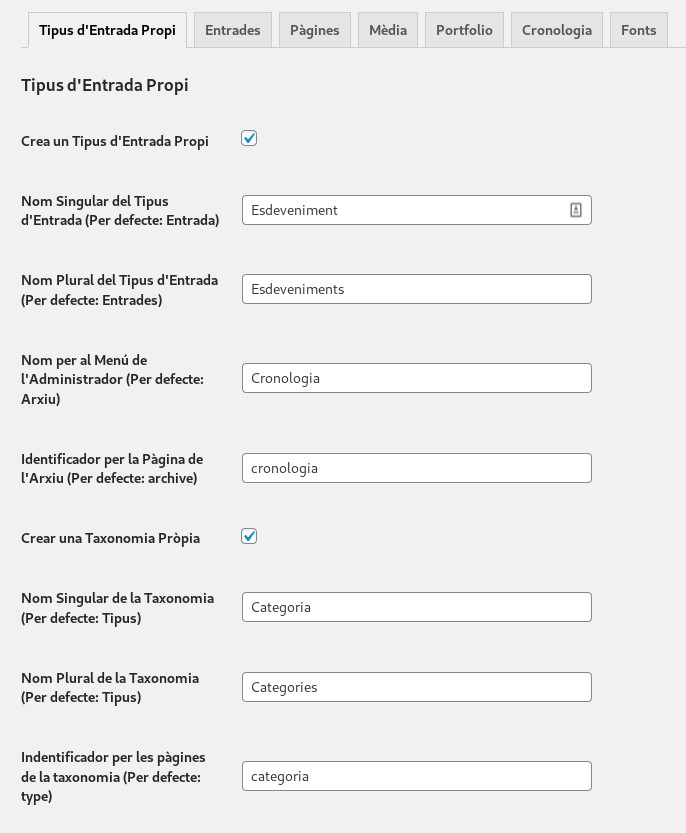

#### Queering the software

http://gendernaut.net/

_Gendernaut_ és un terme anglès que podríem traduir com "generonauta", navegador del gènere, i que invoca als argonautes de Jàson. _Queer_, al seu torn, significa rar, estrany, fora de la norma. El terme apareix per primera vegada en el documental "Gendernauts: A journey through shifting identities" (1999), dirigit per Monika Treut, per refererir-se a aquelles persones que viatgen a través d'identitats de gènere canviants.

_Gendernaut. Queering the software_ és el nom que dóna forma a un projecte polític-artístic on hem dissenyat i programat un programari _open source_ (codi obert) que permet la creació col·lectiva d'arxius a través d'una experiència multimèdia interactiva en línia, una eina que podria ser una aportació rellevant metodològica per a investigacions que provinguin de les humanitats i les ciències socials.

Davant la creixent aparició d'arxius implicats amb la recuperació de la memòria històrica feminista i LGTBI, observem la necessitat de crear eines gratuïtes, de codi obert, que permetin visualitzar la complexitat de les anàlisis històrics, volem fomentar activitats per a la no discriminació per raons d'orientació sexual, identitat de gènere o expressió de gènere en la cultura, crear recursos didàctics i fons documentals, donar accés a bibliografia específica sobre temàtica feminista i LGTBI (Llei 11/2014) i fer accessible l'arxiu perquè s'ajusti als requeriments funcionals i d'interacció que garanteixin la utilització autònoma i còmoda de qualsevol persona (Llei 13/2014).

#### Gendernaut: un plugin de Wordpress

La plataforma escollida per desenvolupar el programari és Wordpress, un gestor de continguts de codi lliure. I la forma ha estat un plugin, de forma que s'integra amb els temes existents sense forçar un disseny a tot el web.

Gendernaut permet crear un arxiu de continguts i visualitzar-lo de 3 formes diferents: matriu, línia de temps i llistat.

Totes les visualitzacions poden ser cercades i filtrades per diferents taxonomies.

També permet crear col·leccions dels continguts amb un títol i una descripció per part de les administradores assignant continguts a categories de la taxonomia col·leccions. Però també que les usuàries del web en creein i les editin posteriorment. Aquestes col·leccions col·laboratives abans de ser públiques han de ser aprovades per les administradores del lloc. 

Finalment, el plugin també crea un apartat i un tipus de contingut on introduir i categoritzar les fonts de les quals ha begut l'arxiu.

Les captures són de http://filsfem.net/arxivaff/ on es pot veure el funcionament del plugin.

#### Funcionament

##### Instal·lació

Primer de tot, descarregueu el fitxer ZIP de l’extensió fent clic [aquí](https://github.com/genderhacker/gendernaut/releases/latest) i seleccionant “Source Code (zip)”.

Un cop dins de l’administrador del vostre lloc Wordpress, aneu a l’apartat “Extensions” > “Afegeix”.

Premeu el botó “Penja l’extensió” i, al diàleg que apareix, seleccioneu el fitxer ZIP que heu descarregat I feu clic a “Instal·la ara”.

Si tot va bé, us indicarà que “S'ha instal·lat amb èxit l'extensió”. Llavors podeu prémer el botó “Activa l’extensió”.

Si també s'instal·la el plugin [Related Posts by Taxonomy](https://es.wordpress.org/plugins/related-posts-by-taxonomy/), al final de cada contingut sortirà un llistat de continguts relacionats.

##### Configuració

Per configurar el funcionament de l’extensió, aneu a l’apartat “Opcions” > “Gendernaut Archive”.

A la pestanya “Tipus d’Entrada Propi” podeu configurar si voleu que l’extensió crei un tipus d’entrada i una taxonomia associada i podeu assignar-los el nom que desitjeu.

També podeu fer servir l’extensió per visualitzar altres Tipus d’Entrada existents. Recomanem fer servir el Tipus Propi de l’extensió,  ja que per ara incorpora més funcionalitat que els demés (com la creació de col·leccions), però si ja disposeu de contingut en un altre Tipus d’Entrada us pot ser útil visualitzar-lo amb Gendernaut Archive.

Disposeu d’una pestanya per a cada Tipus d’Entrada on podeu configurar si s’ha d’emprar Gendernaut Archive per visualitzar-lo i els paràmetres de visualització.

Podeu seleccionar diferents tipus de vista per a cada Tipus d’Entrada, diferents tipus de filtres i un paràmetre d’ordenació. Si seleccioneu un camp propi per a l’ordre, heu d’especificar el nom del camp a l’apartat “Nom del Camp Propi”.

Podeu afegir camps propis a l’apartat «Camps Personalitzats» de la pàgina d’edició de cada entrada (https://wordpress.org/support/article/custom-fields/). Per defecte, Gendenaut Archive mostra aquests camps al final del contingut de la pàgina de cada entrada, excepte quan el nom del camp comença amb un asterisc (*).

També podeu especificar, a la pestanya de configuració de cada Tipus d’Entrada, un camp propi per al títol que ha d’aparèixer a l’arxiu. Això és útil, per exemple, si voleu que aparegui un títol més curt per a les entrades a la pàgina de l’arxiu que a la pàgina individual de cada entrada.

#### Estat actual i canvis

El plugin és funcional, però no ha estat provat, així que us podeu trobar amb problemes.

Així mateix encara no s'ha pogut desenvolupar l'accessibilitat.
